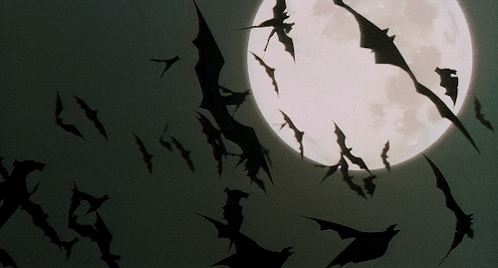
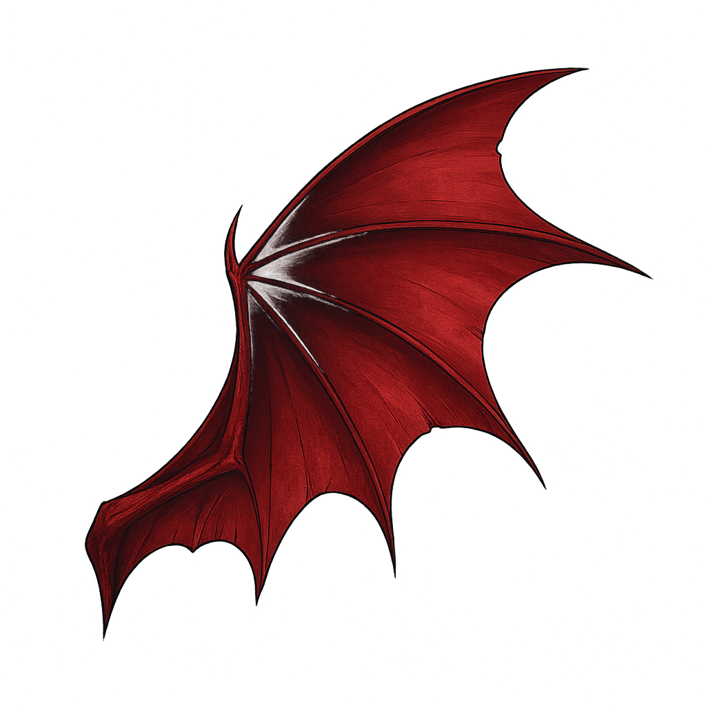
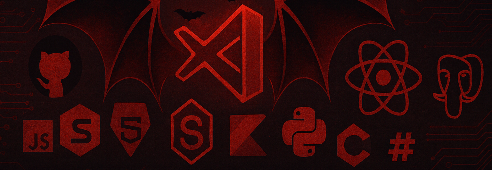

  <h1 style="color:#ff003c;">
    🦇 Greetings, I'm Varchasva Khare!
  </h1>

  

  

    <em>Full Stack Developer | Frontend Developer | UI/UX Designer</em>
  

  

    
    
  

  🦇 Greetings, mortal! I'm a Full Stack Developer and UI/UX Designer who thrives in the darkness, transforming ideas into interactive web experiences under the moonlight.

  I design with eternal precision and build with immortal dedication — from crafting pixel-perfect interfaces that seduce users to writing clean, scalable code that stands the test of time. I'm fluent in the MERN stack and always exploring new ways to make the web faster, smarter, and more enchanting.

  When I'm not feeding on code in the midnight hours, I'm usually sketching new UI concepts or optimizing design systems to perfection.

  <i>Let's create something that will last for eternity... 🩸</i>

#

#

  
  
  

#

    
    

 

#

  <picture>
    <source media="(prefers-color-scheme: dark)" srcset="https://raw.githubusercontent.com/varchasvakhare2022/varchasvakhare2022/output/github-snake-dark.svg" />
    <source media="(prefers-color-scheme: light)" srcset="https://raw.githubusercontent.com/varchasvakhare2022/varchasvakhare2022/output/github-snake.svg" />
    
  </picture>

#

<h1 align="center">
  🦇 Join My Coven 
  
</h1>

  <em>Let's connect under the moonlight and create something eternal together</em>

   
  <a href="https://www.linkedin.com/in/varchasva/" target="_blank">
    <code></code>
  </a>
  <a href="https://www.instagram.com/varchasvkhare/" target="_blank">
    <code></code>
  </a>
  <a href="https://twitter.com/varchasvkhare_" target="_blank">
    <code></code>
  </a>    

### Show your eternal appreciation by starring ⭐ some of my repositories! 🩸

#

